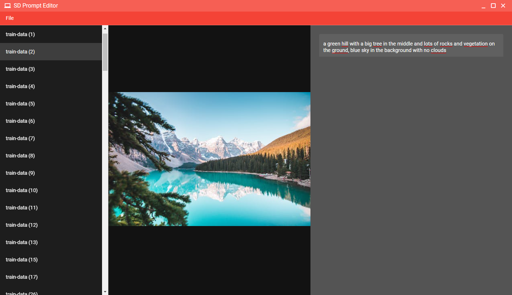

# SD Prompt editor (sd-prompt-editor)

An app to help you write the various prompts for the images in a LORA or Dreambooth prepared folder. This app will group images and txts under the same name, showing them side by side automatically.

To get started, just do File > Open folder. If for one or more images there is no txt file in the same folder, typing in the textarea on the right will automatically create it.



## Install the dependencies
```bash
yarn
# or
npm install
```

### Start the app in development mode (hot-code reloading, error reporting, etc.)
```bash
quasar dev
```


### Lint the files
```bash
yarn lint
# or
npm run lint
```


### Format the files
```bash
yarn format
# or
npm run format
```

### Build the app for testing
```bash
npm run electron:dev
```

### Build the app for production
```bash
npm run electron:build
```

### Under construction
the readme is still being written
